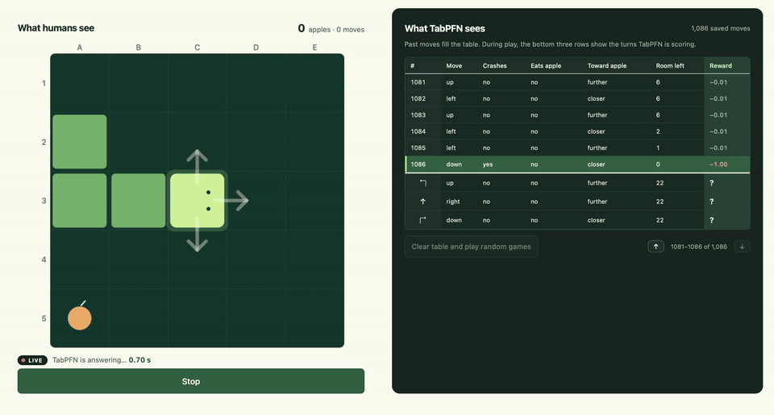

# Snake / TabPFN

<!-- TODO: record a short GIF of the game and save it as docs/demo.gif -->


**TabPFN learns to play Snake from a table of past moves, without any gradient training.**

[TabPFN](https://priorlabs.ai) is a pretrained model for tabular data: give it a table of
examples and it predicts values for new rows. Here every Snake move becomes a row, TabPFN
predicts the future reward of turning left, going straight or turning right, and the snake
takes the best turn. A local web page shows the board and the table TabPFN sees, live.

## How it works

1. **Collect.** The snake makes 1,000 random moves. Rewards: **+1** apple, **−1** crash or
   starvation, **−0.01** otherwise.
2. **Describe moves, not the board.** Each row has five numbers: the `action`, and whether
   it `will_crash`, `will_eat`, gets `closer_to_apple`, and how much `room_left` it leaves.
3. **Fit.** Three rounds of fitted Q iteration (~15–20 s):
   `target = reward + 0.95 × best predicted return from the next state`.
4. **Play.** TabPFN scores the three turns each move; the snake takes the highest. New
   moves join the table, and TabPFN refits after every fifth game.

TabPFN's weights never change, only the table it reads. Inspired by
[ICR-RL](https://arxiv.org/abs/2509.11259).

## Setup

You need Python 3.11–3.14 and [uv](https://docs.astral.sh/uv/getting-started/installation/).

1. **Install**

   ```sh
   git clone https://github.com/RickardKarl/tabpfn-project.git
   cd tabpfn-project
   uv sync
   ```

2. **Get a TabPFN API key** at <https://platform.priorlabs.ai/account/api-keys>.

3. **Start the server** and open <http://127.0.0.1:8000>.

   ```sh
   uv run snake-pfn serve
   ```

   On the first run it asks for your API key and offers to save it to `.env`.

A guided tour starts on the first visit. Every server start begins with a fresh table; the
previous one is backed up in `data/`.

**No API key?** `uv run snake-pfn serve --stub` runs the full app with random predictions
and no network calls.

<details>
<summary>More options</summary>

**Without uv:** `python3 -m venv .venv`, activate it, `pip install .`, then run
`snake-pfn serve` from the project folder.

**Settings** (in `.env` or the environment): `SNAKE_MODEL_VERSION` (`v3.5-fast` or
`v3.5`), `SNAKE_API_TIMEOUT` (20 s), `SNAKE_API_INTERVAL` (0 s between calls),
`SNAKE_BOARD_SIZE` (5). `serve --verbose` logs every move.

**Headless experiments:** the CLI can collect, train, evaluate and compare input sets,
including ones that add the full board:

```sh
uv run snake-pfn collect --episodes 30
uv run snake-pfn compare --episodes 10 --rounds 3
```

See `uv run snake-pfn --help`. Feature sets live in `snake_pfn/control/features.py`.

**Tests:** `uv run pytest -q` (no API calls).
</details>

## Project layout

```text
snake_pfn/
  game/engine.py        Snake rules
  control/features.py   Game state + candidate move → table row
  control/learner.py    TabPFN adapter and fitted Q iteration
  control/runner.py     Background worker: play, save moves, fit
  web/                  FastAPI server and the page
  cli.py                `snake-pfn` command
```
